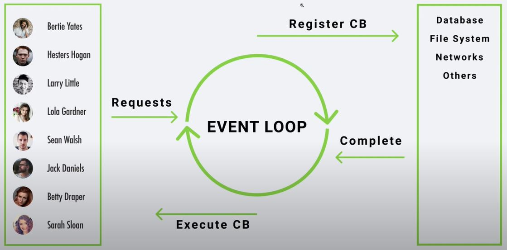

# Node.js DeepDive

## Event Loop

Event loop allow Node.js to perform non-blocking I/O operations. Event loop is basically an endless loop, which waits for tasks, execute them and then sleep until it receives more tasks. 

Node.js is a single-threaded event-driven platform, which is capable of running non-blocking, asynchronous tasks. Since Node.js is single-threaded, the multi-thread operations are assigned to the operating system whenever and wherever possible. Most operating systems are multi-threaded and hence can handle multiple operations executing in the background. 

When one of those operations completes, the OS kernel tells Node.js, and Node.js than adds the appropriate callback to the poll queue to eventually be executed

## Features of Event loop

1. Event loop is endless loop
2. Event loop executes tasks from the event queue only when the call stack is empty. Means when there is no ongoing task
3. The event loop allow us to use callbacks and promises
4. The event loop executes the tasks starting from the oldest first **LIFO stack**

## Event Loop working



1. Consider multiple clients want to perform some operation which is time consuming such as accessing the DB or Network tasks. If this operations are performed in the main loop, then only one operation will be performed at a time. Due to single threaded nature of the Node.js. Because of such behavior no other client can perform the operation until the main loop is free. (Blocking the entire app)
2. With Event loop, Operations are not performed immediately when it is requested. Instead upon requesting for operation, this operations are registered and callback (kind of operation ID) is provided to the client. This operations are offloaded on the OS kernel. Meanwhile event loop will continuously take the requests from other clients and provide them the callbacks. When OS Kernel finishes this tasks, the completion signal is  generated and given back to the client with the response of their respected request. 

## Event Loop Examples : File System

```javascript
const { readFile } = require('fs');

console.log('started first task - file read');


readFile('./content/textFile.txt', 'utf-8', (err, result) => {
    if(err){
        return;
    }
    console.log(result);
    console.log('complete first task - file read');
});

console.log('started next task');
```

```bash
$ output 
> started first task - file read
> started next task		# next task started before completion of file read 
> Content of "textFile.txt"
> complete first task - file read
```

## Event Loop Examples : TimeOut Function

```javascript
console.log('first - 1');

setTimeout(()=>{
    console.log('second - 2');
}, 0);

console.log('three - 3');
```

```bash
$ output 
> first - 1
> three - 3
> second - 2
```

## Promises

A promise is commonly defined as **a proxy for a value that will eventually become available**. **Async functions** use promises behind the scenes, so understanding how promises work is fundamental to understanding how `async` and `await` work.

Once a promise has been called, it will start in a **pending state**. This means that the calling function continues executing, while the promise is pending until it resolves, giving the calling function whatever data was being requested.

The created promise will eventually end in a **resolved state**, or in a **rejected state**, calling the respective callback functions (passed to `then` and `catch`) upon finishing.

**Creating Promises** (A function)

<u>File : Promise.js</u>

```javascript
let done = true;

// promise function
const isItDoneYet = new Promise((resolve, reject)=>{
    if(done){
        resolve('yes it is done')
    } else {
        reject('still in progress')
    }
})

module.exports = { isItDoneYet };
```

The Promise function releases one of the two options. Either Resolve or Reject. In above code snippet, if done variable is true then isItDoneYet promise will release resolve, and if done variable is false then promise will send the reject. 

**Consuming Promises**

<u>File : promiseConsumption.js</u>

```javascript
const promise = require('./promise');

const checkIfItsDone = () => {
    promise.isItDoneYet
    .then(ok => {
        console.log(ok);
    })
    .catch(err => {
        console.error(err);
    })
}

checkIfItsDone();
```

Running `checkIfItsDone()` will specify functions to execute when the `isItDoneYet` promise resolves (in the `then` call) or rejects (in the `catch` call).

## Async Await

**Async**

Async functions are available natively in Node and are denoted by the `async` keyword in their declaration. They always return a promise, even if you don’t explicitly write them to do so. 

Async await combination is much cleaner alternative of the promise implementation of the 

**Sample async function**

```javascript
let done = true;

async function isItDone() {
    if(done){
        return Promise.resolve("Yes it is done");
    }
    else {
        return Promise.reject('no it is not done');
    }
}

module.exports = { isItDone };
```

Async Function always return the resolve value

```javascript
let done = true;

async function isItDone() {
	return 'Yes it is done';
}

module.exports = { isItDone };
// even though we are not sending the reject value, we can still handle the reject value as an error in receiving function 
```

Consuming the async function is exactly same as consuming the promises

**Sample usage of Await**

Await keyword can only be used in the async function. Await keyword make the function wait until the promise is resolved. 

```javascript
async function awaitSample() { 
    console.log('task1');

    let myPromise = new Promise((res, rej)=>{
        setTimeout(() => {
            res('time up..!')
        }, 3000);
    })

    console.log(await myPromise);
    console.log('task2');
}

awaitSample();
```

Above async function will wait for the promise to be fulfill, above function will not exit until promise is not fulfilled. The function will not be exited for 3 seconds (time out duration)

Async/await and Promise can be easily solved by RxJs observables, which is much cleaner and easy to maintain. 

## Events and Event-Driven Programming

A program react to the inputs/event and perform certain task on the basis. A program can react to the change in inputs. This inputs can be occur programmatically or by user.  All the browser apps (GUI) uses event driven programming one way or another. Such programming is heavily used in Node.js based backend as well. It is similar to the Angular10 framework's event emitter.

**Create custom Event Emitter**

```javascript
const EventEmitter = require('events');

const customEmitter = new EventEmitter();

customEmitter.on('response', 
()=>{
    console.log(`data received `);
});

customEmitter.on('response', 
()=>{
    console.log(`some other logic `);
});

// first you always listen the event and then  emit the event
customEmitter.emit('response');
```

 **Custom Event Emitter with multi argument**

```javascript
const EventEmitter = require('events');

const customEmitter = new EventEmitter();

customEmitter.on('response', (ARG1, ARG2)=>{
    console.log('listening for response');
    console.log('arg1 : '+ ARG1);
    console.log('arg2 : '+ ARG2);
});

customEmitter.on('response', ()=>{
    console.log('listening to response');
});

customEmitter.emit('response', 'argument1', 'argument2');
```

## Streams

Streams are objects that let you read data from a source or write data to a destination in continuous fashion. Applicable while reading and writing big size files or data. In Node.js, there are four types of streams −

1. Readable : Stream which is used for read operation.
2. Writable : Stream which is used for write operation.
3. Duplex : Stream which can be used for both read and write operation.
4. Transform : A type of duplex stream where the output is computed based on input.

Streams extends the event emitter class, therefore all the event emitter feature can be used with stream.

**Sample file read using stream**

```javascript
const {createReadStream} = require('fs');

const stream = createReadStream('./content/big.txt');

stream.on('data', (result)=>{
    console.log(result);
})

// big.txt is the chunky file
```

**Output**

```
<Buffer 68 65 6c 6c 6f 20 77 6f 72 6c 64 20 30 0a 68 65 6c 6c 6f 20 77 6f 72 6c 64 20 31 0a 68 65 6c 6c 6f 20 77 6f 72 6c 64 20 32 0a 68 65 6c 6c 6f 20 77 6f ... 65486 more bytes>
<Buffer 77 6f 72 6c 64 20 33 39 32 30 0a 68 65 6c 6c 6f 20 77 6f 72 6c 64 20 33 39 32 31 0a 68 65 6c 6c 6f 20 77 6f 72 6c 64 20 33 39 32 32 0a 68 65 6c 6c 6f ... 65486 more bytes>
<Buffer 6f 72 6c 64 20 37 37 37 35 0a 68 65 6c 6c 6f 20 77 6f 72 6c 64 20 37 37 37 36 0a 68 65 6c 6c 6f 20 77 6f 72 6c 64 20 37 37 37 37 0a 68 65 6c 6c 6f 20 ... 37768 more bytes>
```

The output is 65kbyte chunks instead of the 10000 strings. The default buffer size is 65486 bytes. The last chunk is the remainder in the big.txt file.

**Some additional options in stream**

```javascript
const {createReadStream} = require('fs');

const stream = createReadStream('./content/big.txt', {
    highWaterMark:90000, 
    encoding:'utf-8'});

stream.on('data', (result)=>{
    console.log(result);
})

stream.on('error', (err)=>{
    console.log(err)
});
```

HighwaterMark property allows to modify the default buffer size. Encoding allows to change the encoding of file while reading it. Error in file reading can also be obtain as shown above.